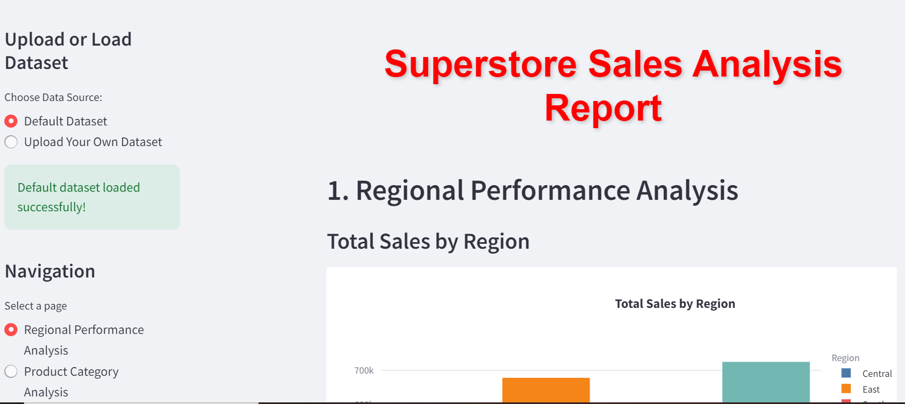

# Superstore Sales Analysis Report

## Overview

This Streamlit app provides an interactive **Superstore Sales Analysis Report**. Users can either use the default dataset or upload their own dataset for analysis. The app covers several aspects of sales and performance analysis, including regional performance, product category, sales trends, discount strategy, and correlation analysis.

### Key Features:
- **Dataset Options**: Choose between a default dataset or upload your own Excel file.
- **Interactive Visualizations**: Use Plotly and Seaborn to generate interactive charts and graphs.
- **Dynamic Dashboard**: The app provides a navigation sidebar to switch between various analysis sections.
- **Customization**: The app has a custom-designed interface with a dynamic color scheme and custom buttons.

## Technologies Used

- **Python**: Main programming language.
- **Streamlit**: For building interactive web applications.
- **Pandas**: For data manipulation and analysis.
- **Plotly**: For creating interactive plots.
- **Seaborn**: For creating statistical visualizations.
- **Matplotlib**: For additional plotting.

## Sections of the App

1. **Regional Performance Analysis**: 
   - Total Sales and Profit Margin by Region.
   
2. **Product Category Analysis**: 
   - Profit Margin and Sales across different categories and sub-categories.
   
3. **Sales Trends by Seasonality**: 
   - Monthly sales trends over selected years.
   
4. **Discount Strategy Analysis**: 
   - Distribution and impact of discounts on sales.
   
5. **Product Performance**: 
   - Top-performing products by sales.
   
6. **State-wise Performance**: 
   - Quantity sold by state.

7. **Correlation Analysis**: 
   - A correlation heatmap showing relationships between key metrics like sales, profit, discount, and quantity.

## Installation

1. Clone this repository:
    ```bash
    git clone https://github.com/zeeshan-ayaz/Superstore_Sales_Analysis.git
    ```

2. Navigate to the project directory:
    ```bash
    cd Superstore-Sales-Analysis
    ```

3. Install required dependencies:
    ```bash
    pip install -r requirements.txt
    ```

4. Run the app:
    ```bash
    streamlit run app.py
    ```

## Usage

- **Default Dataset**: The app comes with a default Superstore dataset. Simply launch the app to start analyzing.
- **Upload Your Own Dataset**: To upload your dataset:
    1. Navigate to the **sidebar** and choose "Upload Your Own Dataset."
    2. Upload an Excel file (`.xlsx` format) for analysis.
    
### Screenshots

#### App Home Page



## Folder Structure

```bash
superstore-sales-analysis/
│
├── app.py              # The main Streamlit app
├── superstore.xlsx      # Default dataset
├── requirements.txt     # Python dependencies
├── README.md            # Project documentation (this file)
└── screenshots/         # Folder for app screenshots
